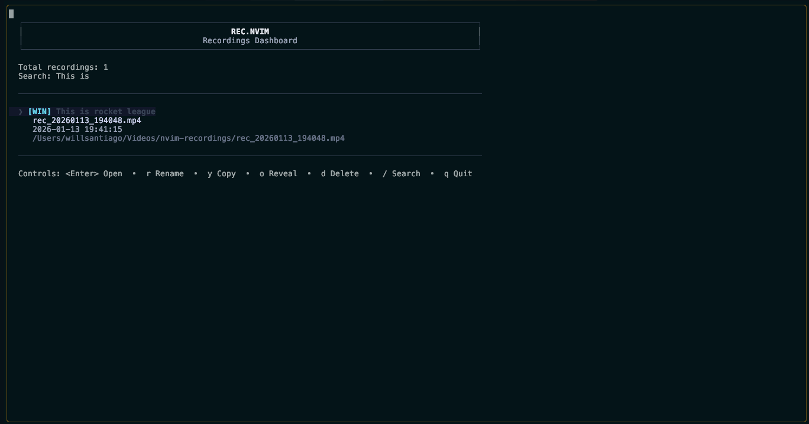
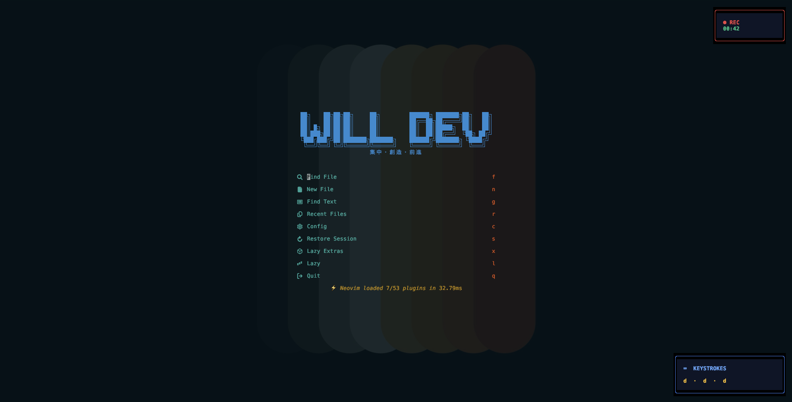

# rec.nvim

Neovim screen recorder powered by a Rust CLI (ffmpeg) with a lightweight UI, window selection, and a built-in recordings dashboard.

## Highlights

- Fullscreen and window-only recording (drag-to-select or full window)
- Preview overlay before capture
- Keystroke overlay and HUD timer
- Auto-titles based on git/editor context
- Dashboard with search, rename, copy path, and reveal-in-file-manager

## Requirements

- macOS (current ffmpeg input uses avfoundation)
- `ffmpeg` installed and on PATH
- `rec-cli` built from this repo

## Install

Use your favorite plugin manager and point to this repo:

```lua
-- lazy.nvim
{
  "rec.nvim",
  config = function()
    require("rec").setup()
  end,
}
```

## Build the CLI

From the repo root:

```sh
cd crates/rec-cli
cargo build
```

This plugin currently expects the binary at:

```
~/dev/rec.nvim/crates/rec-cli/target/debug/rec-cli
```

If your path is different, update `REC_CLI` in `lua/rec/init.lua`.

## Usage

Commands:

- `:RecStart` – start fullscreen recording
- `:RecWin` – drag to select a region (mouse or hjkl)
- `:RecFullWin` – record the full current window
- `:RecPause` / `:RecResume` – pause/resume recording
- `:RecStop` – stop and save recording
- `:RecCancel` – stop and discard recording
- `:RecOpen` – open latest recording
- `:RecDashboard` – open recordings dashboard
- `:RecDevices` – list capture devices (from `rec-cli`)
- `:RecDebug` – debug output and metadata info

Window selection (RecWin):

- Drag with the mouse to draw a region
- `h/j/k/l` resize the selection
- `H/J/K/L` move the selection
- `Enter` confirms, `Esc` cancels

Dashboard shortcuts:

- `j/k` or arrows: move selection
- `Enter`: open
- `r`: rename title
- `y`: copy file path
- `o`: reveal in file manager
- `/`: search
- `d`: delete
- `q` or `Esc`: close

## Configuration

```lua
require("rec").setup({
  recording = {
    output_dir = "~/Videos/nvim-recordings",
    auto_open = false,
    open_command = nil,
  },
  overlay = {
    position = "bottom-right",
    max_keys = 5,
    opacity = 95,
    width = 32,
    height = 5,
    padding = { row = 1, col = 2 },
    custom_position = nil,
  },
  keys = {
    show_overlay = true,
    max_repeat_count = 3,
    ignore_navigation = true,
    ignore_mouse = true,
    separator = "  ·  ",
  },
})
```

## Images





## Notes

- Fullscreen recording does not use crop.
- Window recording uses crop + clamping to avoid ffmpeg errors.
- Titles are generated on stop and stored in metadata.
